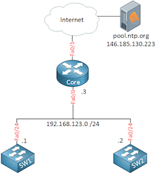

# Interpréter un diagramme réseau

## Introduction

Les diagrammes de réseau sont des aides visuelles qui permettent de comprendre comment un réseau est conçu et qui décrit la manière dont il fonctionne
Un digramme de réseau est en quelque sorte une cartes d'un réseau

Les digramment **illustrent la manière dont les équipement sont interconnectés**, en indiquant les ports utilisés.

Le schéma montre un diagramme physique. Il fournit des informations sur des **équipements et des cables** (links) courrament utilisés dans un réseau d'entreprise

## Notations des diagrammes

Notation pour les slots des équipement : **slot# / port#**

Exemples :
* **Te 1/4** (Le quatrième port du 1er slot) : **slot# / subslot# / port# :**
* **G1/2/1** (Le premier port du slot 1 et du sous-slot 2)

Un slot est **une ouverture dans un routeur ou switch** qui permet d'y installer un module. Certains switchs n'ont pas de slot modulaire (switch à port fixe), et tout leurs ports sont assignés au slot 0

Cisco utilise les abbréviations suivantes pour les vitesses de port :

| Name                   | Abberviation | Example |
| ---------------------- | ------------ | ------- |
| Ethernet               | E            | E0/0    |
| FastEthernet           | Fa           | Fa0/1   |
| GigabitEthernet        | Te           | Te1/5   |
| FortyGigabitEthernet   | Fo           | Fo1/0/1 |
| HundredGigabitEthernet | Hu           | Hu1/0/2 |
